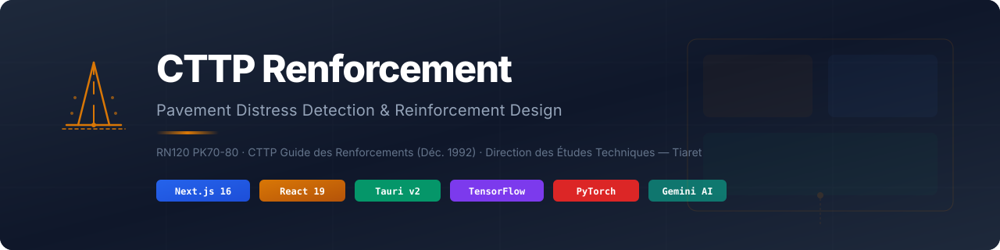
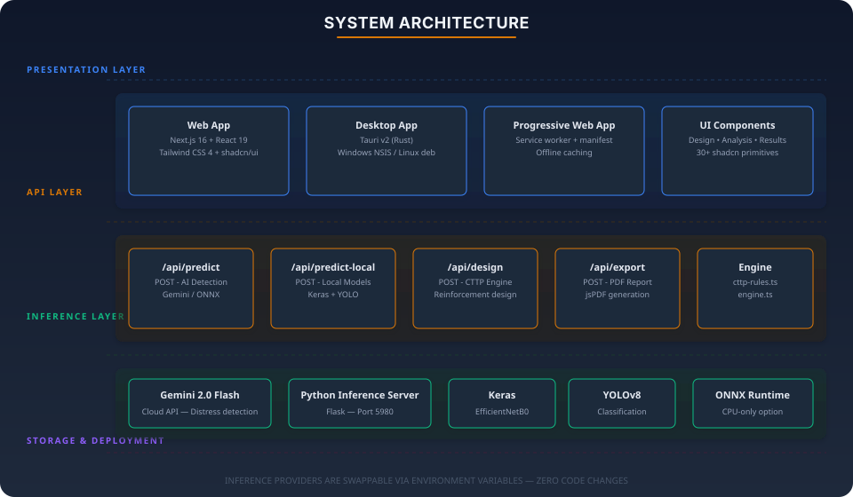
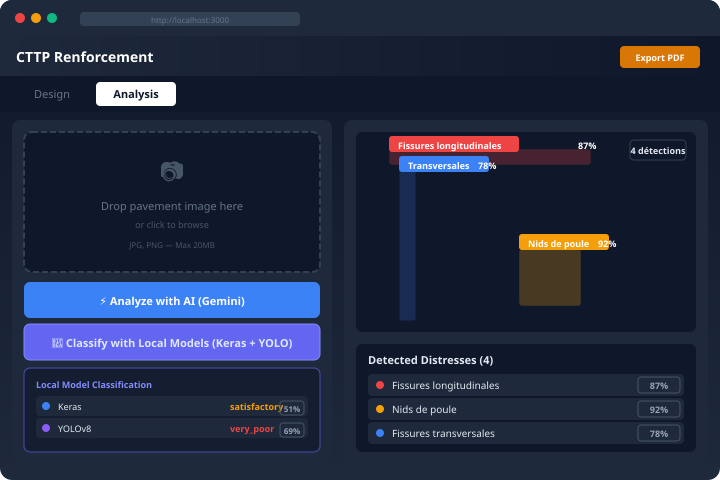
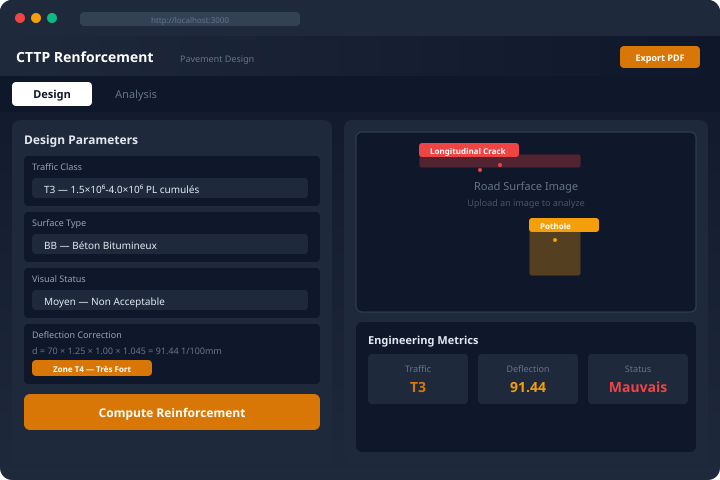
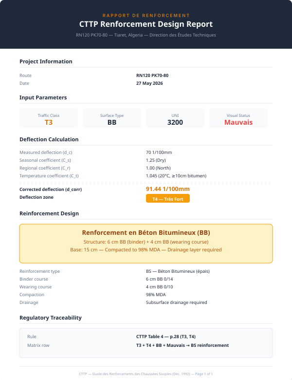
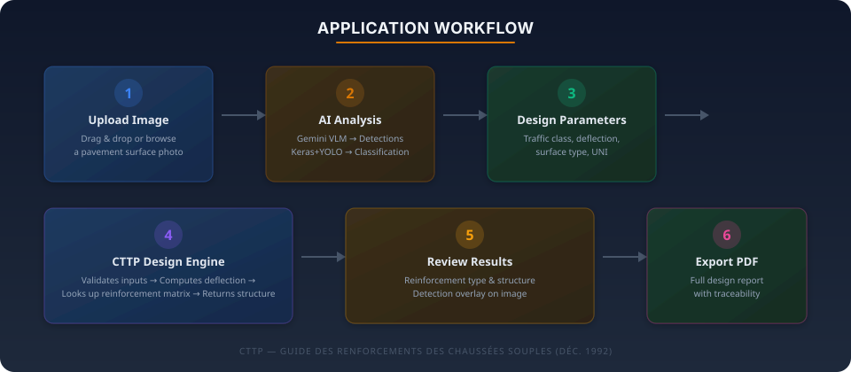

<p align="center">
  
</p>

<p align="center">
  <a href="#features"></a>
  <a href="#tech-stack"></a>
  <a href="#tech-stack"></a>
  <a href="#getting-started"></a>
  <a href="docs/THESIS_VALIDATION.md"></a>
  <br>
  <a href="#installation"></a>
  <a href="#deployment"></a>
  <a href="#ai-models"></a>
</p>

---

## 📋 Table of Contents

- [Overview](#-overview)
- [Features](#-features)
- [Architecture](#-architecture)
- [AI Models](#-ai-models)
- [Tech Stack](#-tech-stack)
- [Installation](#-installation)
- [Usage Guide](#-usage-guide)
- [Testing](#-testing)
- [Deployment](#-deployment)
- [Project Structure](#-project-structure)
- [API Reference](#-api-reference)
- [Environment Variables](#-environment-variables)

---

## 🏗️ Overview

**CTTP Renforcement** is a production-grade engineering application for **pavement distress detection and CTTP-compliant reinforcement design**, built for the **RN120 PK70-80** rehabilitation project in **Tiaret, Algeria**.

The application solves two core problems in pavement engineering:

| Problem | Solution |
|---------|----------|
| **Condition Assessment** | Upload road surface images → AI models detect & classify distresses automatically |
| **Reinforcement Design** | Input traffic & deflection data → CTTP rule engine computes compliant reinforcement structures |

Developed in collaboration with the **Direction des Études Techniques (DET)** and following the **CTTP Guide des Renforcements des Chaussées Souples (Déc. 1992)** — the official Algerian technical standard for flexible pavement reinforcement.

---

## ✨ Features

### 🧠 AI-Powered Pavement Assessment

| Model | Type | Input | Classes | Accuracy | Framework |
|-------|------|-------|---------|----------|-----------|
| **EfficientNetB0** (Keras) | Image Classification | 224×224 RGB | 4 road conditions | ~96% | TensorFlow |
| **YOLOv8-cls** (Ultralytics) | Image Classification | 224×224 RGB | 4 road conditions | ~98% | PyTorch |
| **Gemini 2.0 Flash** (opt.) | Visual Language Model | Any resolution | Distress detection + bounding boxes | — | Google API |

All three models work together or independently. The **Keras + YOLO** models run locally (air-gapped), while Gemini provides cloud-based distress detection with bounding box visualization.

### 📐 CTTP-Compliant Design Engine

- **Traffic class** determination (T0–T5) per CTTP classification
- **Deflection correction** with seasonal (C<sub>s</sub>), regional (C<sub>r</sub>), and temperature (C<sub>t</sub>) coefficients
- **Reinforcement type selection** — BS, BC, GB, BB, ES
- **Layer structure** definition with thicknesses, materials, and compaction requirements
- **Full traceability** — every design decision links to its regulatory source

### 📊 Professional PDF Reports

Generate comprehensive engineering reports containing:
- Project metadata and input parameters
- Deflection calculation trace with all coefficients
- AI distress detection overlay map
- Final reinforcement structure with materials
- Regulatory traceability (CTTP table references)

### 🌐 Cross-Platform

| Platform | Support | Packaging |
|----------|---------|-----------|
| 🌐 Web | ✅ Full | Vercel, Docker, standalone |
| 🖥️ Windows | ✅ Full | NSIS installer (`.exe`) |
| 🐧 Linux | ✅ Full | Debian package (`.deb`) |
| 📱 PWA | ✅ Full | Service worker + offline cache |

---

## 🏛️ Architecture

<p align="center">
  
</p>

### Data Flow

1. **User** uploads a pavement image or enters design parameters in the **React UI**
2. The **Next.js API layer** routes requests to the appropriate backend:
   - `/api/predict` → Gemini 2.0 Flash (cloud) or ONNX Runtime (local)
   - `/api/predict-local` → Python inference server (Keras + YOLO)
   - `/api/design` → CTTP rule engine (TypeScript)
3. **Inference results** flow back through the API to the frontend for visualization
4. **PDF reports** are generated client-side via jsPDF

### Inference Provider Architecture

All AI backends implement a common `InferenceProvider` interface, making them **swappable via a single environment variable** — zero code changes required:

```typescript
interface InferenceProvider {
  readonly name: string
  analyze(imageBuffer: Buffer, mimeType: string): Promise<InferenceResult>
}
```

```bash
INFERENCE_BACKEND=gemini   # Google Gemini 2.0 Flash (default)
INFERENCE_BACKEND=onnx     # ONNX Runtime (CPU)
INFERENCE_BACKEND=python   # Local Keras + YOLO models
```

---

## 🎯 AI Models

<p align="center">
  
</p>

The application integrates three distinct AI models for comprehensive pavement assessment:

### Keras EfficientNetB0
- **Framework:** TensorFlow / Keras
- **Architecture:** EfficientNetB0 (transfer learning)
- **Input:** 224×224×3 RGB images
- **Output:** 4-class softmax (good, satisfactory, poor, very_poor)
- **Size:** 46 MB (trained)
- **Validation Accuracy:** ~96%

### YOLOv8-cls
- **Framework:** PyTorch / Ultralytics
- **Architecture:** YOLOv8 classification head
- **Input:** 224×224×3 RGB images
- **Output:** 4-class softmax (good, satisfactory, poor, very_poor)
- **Size:** 10.3 MB (ultra-lightweight)
- **Validation Accuracy:** ~98%
- **Inference Speed:** ~1.4ms per image (GPU)

### Gemini 2.0 Flash (Optional)
- **Framework:** Google Vertex AI
- **Capability:** Visual-language understanding with distress detection and bounding box localization
- **Distress Types:** Fissures longitudinales, Nids de poule, Arrachements, Orniérage, and 6 more
- **Requires:** Internet connection + Gemini API key

> The Keras and YOLO models provide an **ensemble prediction** — both classify the same image independently, and their predictions are combined into a single consensus result with confidence weighting.

---

## 💻 Tech Stack

<p align="center">
  
</p>

| Layer | Technology | Purpose |
|-------|-----------|---------|
| **Framework** | Next.js 16 (App Router) | Full-stack React framework |
| **UI** | React 19 + Tailwind CSS 4 | Component rendering & styling |
| **Components** | shadcn/ui (Radix primitives) | Accessible UI components |
| **Forms** | react-hook-form + Zod | Input validation & form state |
| **State** | Zustand + TanStack React Query | Client & server state |
| **Icons** | Lucide React | Icon library |
| **Charts** | Recharts | Data visualization |
| **PDF** | jsPDF | Client-side PDF generation |
| **i18n** | next-intl | French / English |
| **Classification** | TensorFlow + PyTorch | Local AI inference |
| **Cloud AI** | Google Gemini API | VLM distress detection |
| **Desktop** | Tauri v2 (Rust) | Native desktop shell |
| **Package** | Bun / npm | Dependency management |

---

## 🚀 Installation

### Prerequisites

- **Node.js** 18+ and **npm** (or **Bun**)
- **Python** 3.10+ (for local AI models, optional)
- **Rust/Cargo** (for Tauri desktop build, optional)

### Quick Start (Web)

```bash
# Clone the repository
git clone <repo-url>
cd civil-engineering-cttp-renforcement

# Install frontend dependencies
npm install

# Copy and configure environment
cp .env.example .env
# Edit .env — GEMINI_API_KEY is optional (demo mode works without it)

# Start development server
npm run dev

# Open http://localhost:3000
```

### With Local AI Models

```bash
# Install Python dependencies
pip install -r models/requirements.txt

# Start the inference server (Keras + YOLO)
bash scripts/start-inference-server.sh

# In .env, configure:
INFERENCE_BACKEND=python
INFERENCE_SERVER_URL=http://localhost:5980

# Restart the dev server
npm run dev
```

### Desktop Application (Tauri)

```bash
# Full build (includes Next.js static export)
bash scripts/build.sh

# Or step by step:
cd src-tauri
cargo tauri build
```

---

## 📖 Usage Guide

### Step 1 — Enter Design Parameters

Navigate to the **Design** tab and input the following parameters:

| Parameter | Description | Example |
|-----------|-------------|---------|
| **Traffic Class** | Cumulative heavy truck traffic (T0–T5) | T3 (1.5×10⁶–4.0×10⁶) |
| **Surface Type** | Existing pavement surface | BB (Béton Bitumineux) |
| **Visual Status** | Visual condition assessment | Moyen |
| **UNI** | Uniformity Index (0–5000) | 3200 |
| **Deflection (d_c)** | Measured deflection in 1/100mm | 70 |
| **Season** | Measurement season | Dry |
| **Region** | Project region | North |
| **Temperature** | Pavement temperature at testing | 20°C |

The corrected deflection and deflection zone are computed in **real time**.

### Step 2 — AI Analysis (Optional)

Switch to the **Analysis** tab:

1. **Upload** a pavement surface photo (drag & drop or click to browse)
2. Click **"Analyze with AI"** for Gemini-powered distress detection (cloud)
3. Click **"Classify with Local Models (Keras + YOLO)"** for local classification
4. View detection bounding boxes overlaid on the image
5. The **visual status** is automatically updated based on AI results

### Step 3 — Compute Design

Click **"Compute Reinforcement"** to generate the CTTP-compliant design:

- **Reinforcement type** — BS, BC, GB, BB, or ES
- **Structure** — Layer composition with thicknesses
- **Materials** — Binder and wearing course specifications
- **Compaction** — Required density (% MDA)
- **Drainage** — Drainage requirements
- **Traceability** — CTTP guide section references

### Step 4 — Export Report

<p align="center">
  
</p>

Click the **export button** in the header to generate a professional PDF report containing all design parameters, calculations, and results with full regulatory traceability.

---

## 🧪 Testing

### End-to-End Test Walkthrough

#### 1. Design Calculator Test
```
Input:  T3 + BB + Moyen + UNI 3200 + d_c 70 + Dry + North + 20°C
Output: Corrected deflection ≈ 91.44 1/100mm → Zone T4
        Reinforcement: BS (Béton Bitumineux épais)
        Structure: 6 cm BB binder + 4 cm BB wearing course
```

#### 2. AI Distress Detection Test
1. Upload a pavement photo to the **Analysis** tab
2. Click **"Analyze with AI"**
3. ✅ Detection bounding boxes with severity labels and confidence scores
4. ✅ Detection list with individual confidence percentages

#### 3. Local Model Classification Test
```bash
# Start the inference server
bash scripts/start-inference-server.sh

# Verify it's running
curl http://localhost:5980/health
# → {"status":"ok","keras_loaded":true,"yolo_loaded":true}
```
1. Upload a pavement photo
2. Click **"Classify with Local Models"**
3. ✅ Keras result with status + confidence
4. ✅ YOLO result with status + confidence
5. ✅ Combined ensemble status

#### 4. PDF Export Test
1. Compute a design (steps 1–3 above)
2. Click the **export button**
3. ✅ Professional PDF downloads with all sections populated

#### 5. Offline Mode Test
1. Disconnect from the internet
2. ✅ Offline badge appears in the header
3. ✅ Previously computed results load from cache

#### 6. Desktop Application Test
```bash
cd src-tauri && cargo tauri build
./target/release/cttp-renforcement
```
- ✅ Application launches as native window
- ✅ All functionality works without a browser

### Testing the Python Server Directly

```bash
# Health check
curl http://localhost:5980/health

# Test with a sample image
curl -X POST -F "file=@test_image.jpg" http://localhost:5980/predict

# Expected response structure:
{
  "success": true,
  "keras": {
    "status": "satisfactory",
    "confidence": 51.10,
    "probabilities": { "good": 5.42, "poor": 7.23, ... }
  },
  "yolo": {
    "status": "very_poor",
    "confidence": 69.44,
    "probabilities": { "good": 2.97, "poor": 20.62, ... }
  },
  "combined": { "status": "very_poor", "confidence": 34.72 },
  "processing_time_ms": 1360.51
}
```

---

## 📁 Project Structure

```
├── 📦 models/                          # Trained AI models & inference server
│   ├── 🐍 inference_server.py          # Unified Keras + YOLO API (Flask)
│   ├── 📓 road_condition_model_finetuned.keras  # Keras EfficientNetB0
│   ├── 📂 Yolo-Road-Condition-main/
│   │   └── yolo_road_model.pt          # YOLOv8-cls (10.3 MB)
│   └── requirements.txt                # Python dependencies
│
├── 🌐 src/                             # Application source code
│   ├── 📱 app/                         # Next.js App Router
│   │   ├── api/
│   │   │   ├── predict/route.ts        # Gemini/ONNX inference
│   │   │   ├── predict-local/route.ts  # Local model proxy
│   │   │   ├── design/route.ts         # CTTP design engine
│   │   │   └── export/route.ts         # PDF generation
│   │   └── page.tsx                    # Main SPA page
│   ├── 🧩 components/cttp/             # Application UI
│   │   ├── CalculatorApp.tsx           # Main container
│   │   ├── DetectionCanvas.tsx         # SVG detection overlay
│   │   ├── ImageUploader.tsx           # Drag & drop upload
│   │   ├── MetricsPanel.tsx            # Engineering gauges
│   │   └── ReinforcementPanel.tsx      # Design results
│   ├── ⚙️ lib/                         # Business logic
│   │   ├── engine.ts                   # CTTP rule engine
│   │   ├── cttp-rules.ts               # Design matrices (SOT)
│   │   ├── inference-provider.ts       # Provider abstraction
│   │   ├── python-inference.ts         # Python backend client
│   │   ├── client-predict.ts           # Browser Gemini client
│   │   ├── pdf-generator.ts            # PDF report builder
│   │   └── translations.tsx            # i18n (FR/EN)
│   └── hooks/                          # Custom React hooks
│
├── 🖥️ src-tauri/                       # Tauri desktop shell
│   ├── src/main.rs                     # Entry point + sidecar
│   └── tauri.conf.json                 # Desktop configuration
│
├── 📜 scripts/                         # Build & launch scripts
│   ├── build.sh                        # Production build
│   ├── start-inference-server.sh       # Python server launcher
│   └── build-inference-server.sh       # PyInstaller bundler
│
├── 📚 docs/
│   ├── images/                         # README visuals
│   │   ├── hero-banner.svg
│   │   ├── architecture.svg
│   │   ├── workflow.svg
│   │   ├── screenshot-design.svg
│   │   ├── screenshot-analysis.svg
│   │   └── screenshot-pdf.svg
│   └── THESIS_VALIDATION.md            # Thesis defense checklist
│
└── 📄 README.md                        # This document
```

---

## 🌐 API Reference

| Route | Method | Input | Description | Response |
|-------|--------|-------|-------------|----------|
| `/api/predict` | POST | multipart `image` (file) | AI distress detection | `{ detections[], image_status, model_used }` |
| `/api/predict-local` | POST | multipart `image` (file) | Local Keras + YOLO classification | `{ keras_result, yolo_result, combined_status }` |
| `/api/design` | POST | JSON `DesignInput` | CTTP reinforcement design | `{ reinforcement_type, structure, traceability }` |
| `/api/export` | POST | JSON `ExportInput` | PDF report generation | PDF binary (application/pdf) |
| `/api` | GET | — | Health check | `{ status: "ok" }` |

---

## ⚙️ Environment Variables

| Variable | Required | Default | Description |
|----------|----------|---------|-------------|
| `GEMINI_API_KEY` | No* | — | Google Gemini API key for VLM distress detection |
| `NEXT_PUBLIC_GEMINI_CONFIGURED` | No | `false` | Set to `true` when Gemini key is configured in env |
| `INFERENCE_BACKEND` | No | `gemini` | AI backend: `gemini`, `onnx`, or `python` |
| `INFERENCE_SERVER_URL` | No | `http://localhost:5980` | URL of the Python inference server |
| `ONNX_MODEL_PATH` | No | — | Path to ONNX model (for `onnx` backend) |
| `NEXT_OUTPUT` | No | `standalone` | Override Next.js output mode |

*\*Without a Gemini key, the app runs in **demo mode** with simulated detections for UI testing.*

---

## 🚢 Deployment

### Vercel (Recommended for Web)

```bash
npm install -g vercel
vercel

# Set environment variables in Vercel dashboard:
# - GEMINI_API_KEY
# - NEXT_PUBLIC_GEMINI_CONFIGURED=true
```

### Desktop (Tauri)

```bash
bash scripts/build.sh
# Output: src-tauri/target/release/bundle/
```

### Docker (Coming Soon)

```bash
# Build the Docker image
docker build -t cttp-renforcement .

# Run
docker run -p 3000:3000 cttp-renforcement
```

---

## 📄 License

**CTTP Renforcement** — Direction des Études Techniques, Tiaret, Algeria.

Built for the **RN120 PK70-80** pavement rehabilitation project. This application implements the **CTTP Guide des Renforcements des Chaussées Souples** (December 1992), the official Algerian technical standard for flexible pavement reinforcement design.

<p align="center">
  
</p>

---

<p align="center">
  <sub>Built with ❤️ for the Direction des Études Techniques — Tiaret, Algeria</sub>
  <br>
  <sub>CTTP — Contrôle Technique des Travaux Publics — Algiers</sub>
</p>
